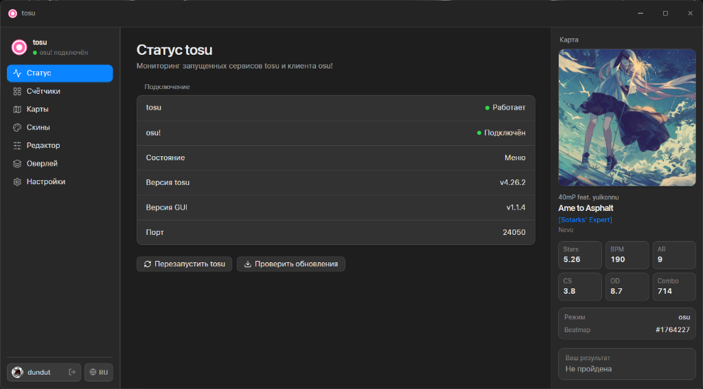
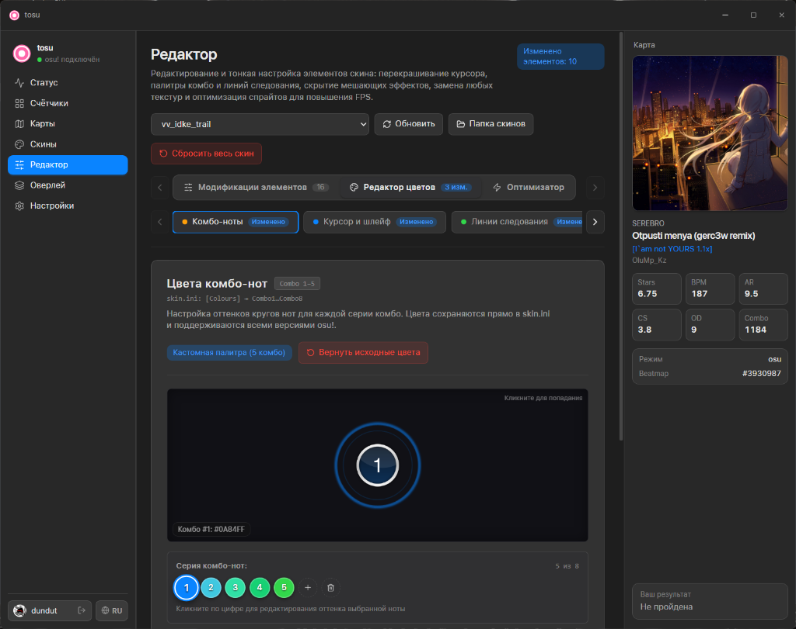
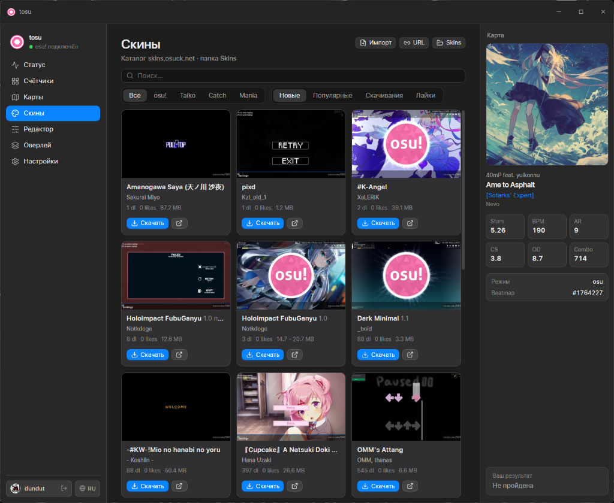

# tosu-gui

[English](#english) | [Русский](#русский)

---

## English

A desktop GUI for [tosu](https://github.com/tosuapp/tosu) — an osu! memory reader with an in-game overlay.

This is a standalone application window (not a browser tab) that provides status monitoring, counters management, overlay settings, and built-in updates.

### Features
- tosu status & osu! connection monitoring
- Counters installation and download catalog
- Overlay settings (hotkeys, FPS, Anti-Aliasing)
- Built-in updates for tosu and tosu GUI from the interface

**For a full overview, detailed features, and downloads, please visit the website:** 
👉 **[absolute2007.github.io/tosu-gui](https://absolute2007.github.io/tosu-gui/)**

### Screenshots

---

## Русский

Десктопный GUI для [tosu](https://github.com/tosuapp/tosu) — memory reader для osu! с in-game оверлеем.

Это полноценное окно приложения (а не вкладка браузера), где есть статус, менеджер счётчиков, настройки оверлея и обновления.

### Возможности
- мониторинг статуса tosu и подключения osu!
- установленные счётчики и каталог для их скачивания
- настройки оверлея (горячие клавиши, FPS, сглаживание)
- обновление tosu и самой tosu GUI прямо из интерфейса

**Для полного обзора, подробного описания функционала и скачивания посетите сайт:** 
👉 **[absolute2007.github.io/tosu-gui](https://absolute2007.github.io/tosu-gui/)**

### Скриншоты

